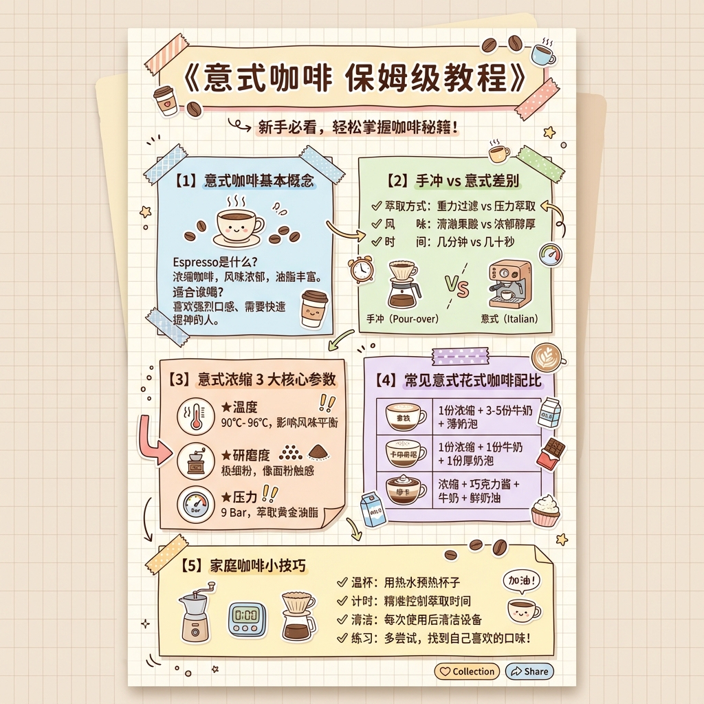
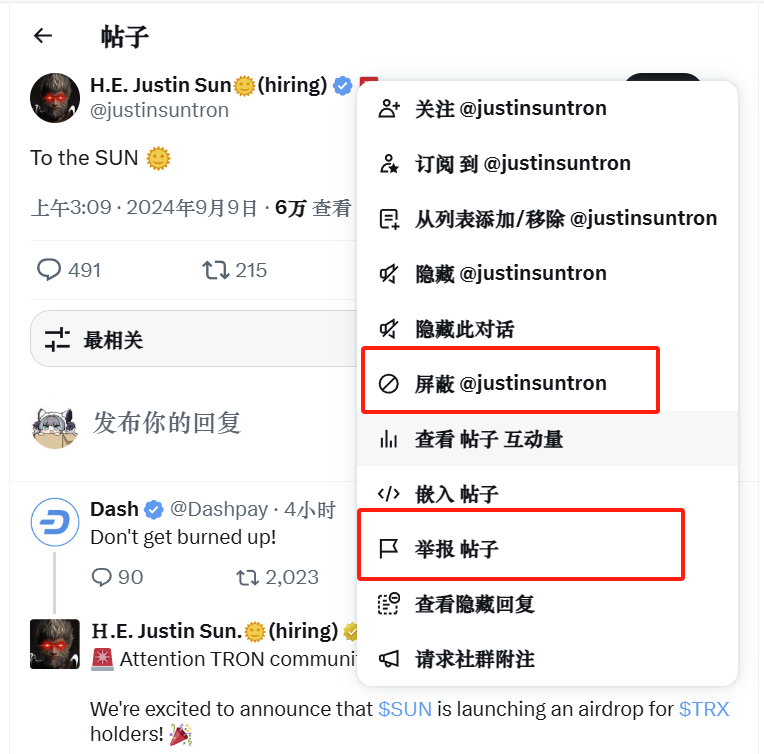
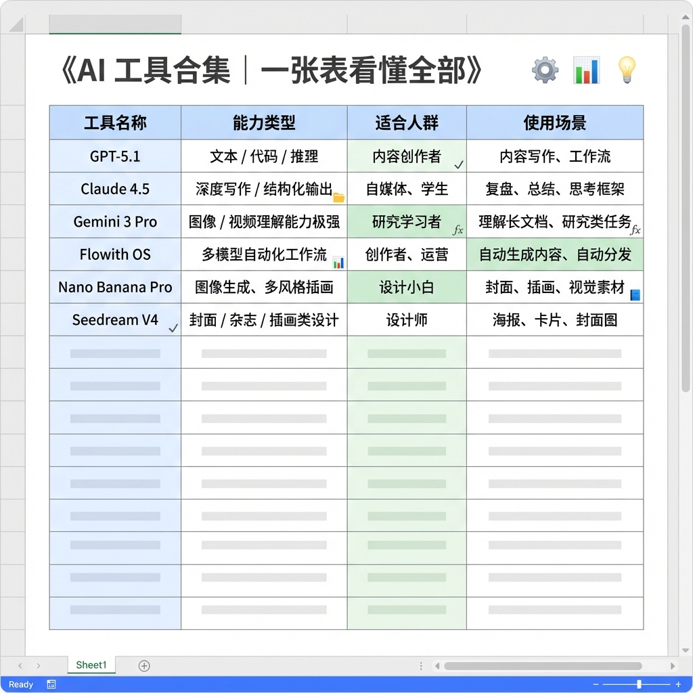
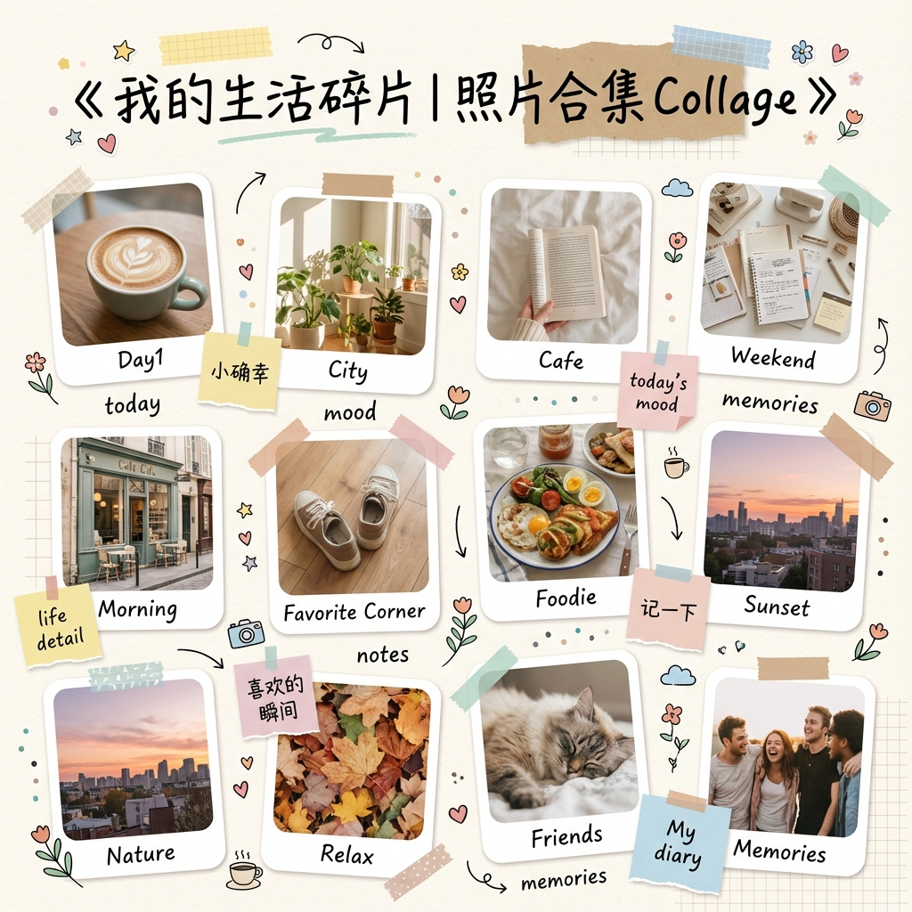
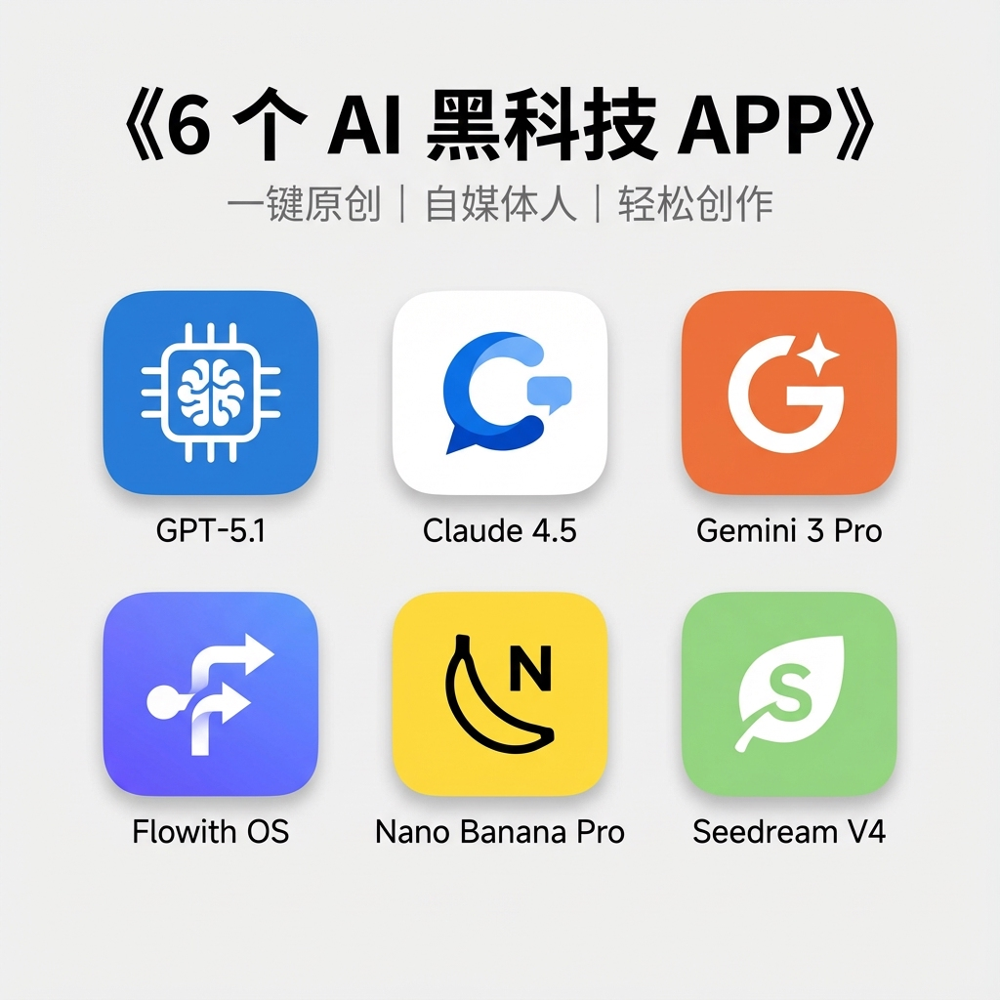
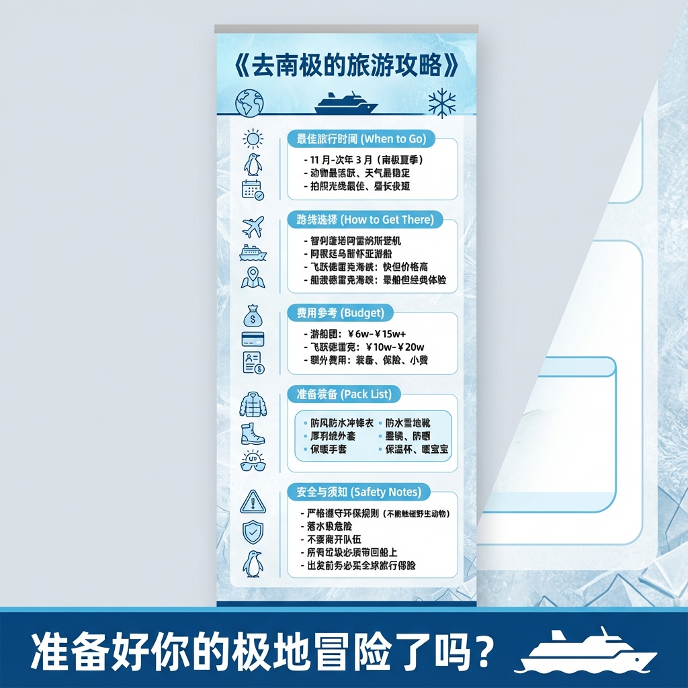
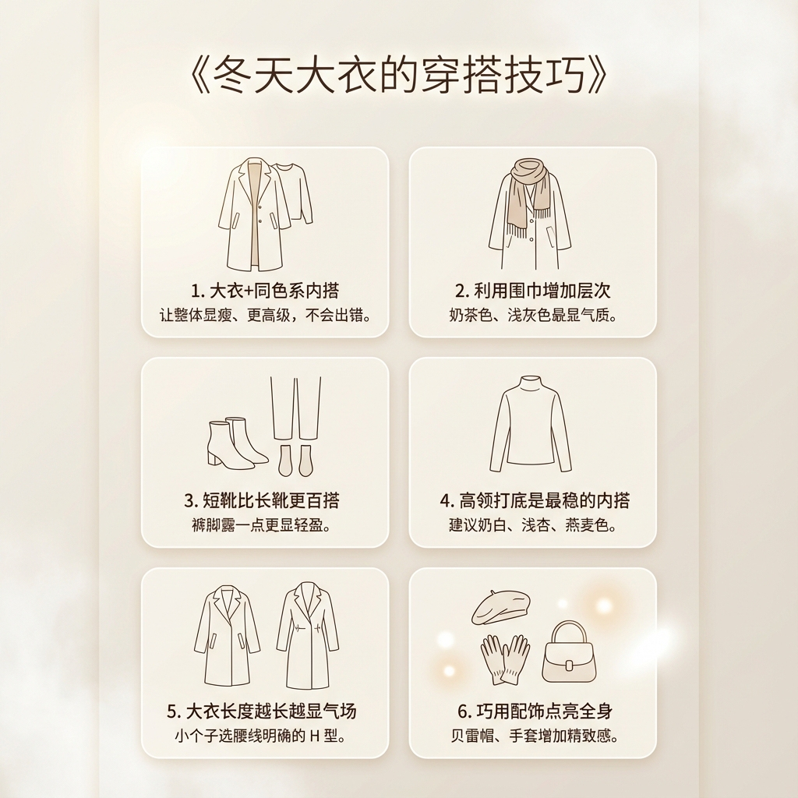
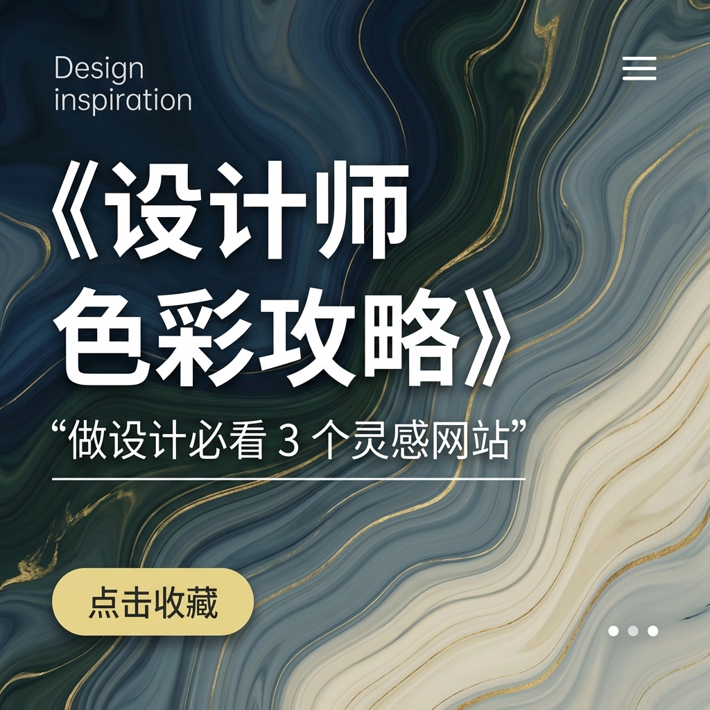

# 生图提示词

生成照片提示词

<pre><code>【我的生图要求】
请模仿下面的示例提示词为我生成相应的图片生成提示词
<strong>示例： { "image_description": { "subject": "A Japanese woman with natural fresh beauty taking a lifestyle photo near Burj Khalifa during daytime. She holds a Binance-themed drink bottle or tote bag in a casual, influencer-style pose.", "photo_style": { "type": "bright lifestyle portrait", "lighting": "strong Dubai sunlight, clear blue sky", "camera_angle": "eye-level iPhone-style shot", "mood": "fresh, travel, luxury" }, "clothing_and_appearance": { "outfit": "light summer dress with soft yellow-black Binance-inspired accents", "accessories": "sunglasses, gold jewelry", "expression": "joyful, relaxed" }, "environment": { "setting": "Dubai Downtown, near Burj Khalifa", "background_elements": [ "clear blue sky", "towering Burj Khalifa", "modern Dubai architecture", "palm trees and water features" ] }, "aesthetic": { "style": "Instagram travel influencer", "features": [ "sun-kissed tones", "clean composition", "Binance yellow color accents" ] } } }
</strong></code></pre>



<figure><figcaption></figcaption></figure>




```
[THEME] = 意式咖啡保姆级教程
[STYLE] = 小清新手账风（Fresh Pastel Hand-drawn Note Style）

生成一张小红书爆款视觉的小清新手账风海报。整体画风是“清爽、可爱、干净、便于笔记收藏”。采用浅色马卡龙配色、手写涂鸦、贴纸元素、格纹纸背景、极简线条图标，整体信息排布像一本整理得很漂亮的学习手账。

————————————————————

# ① 标题区（Top Title）
在海报顶部绘制一个醒目但温柔的“手账标题框”。
标题内容写为：

《意式咖啡 保姆级教程》

标题字体：圆润手写体、稍粗、有可爱感  
左右加入小贴纸元素：咖啡豆、咖啡杯、小星星、胶带贴纸、箭头涂鸦  
标题区背景为淡色标签条（奶油黄 / 淡蓝 / 雾粉任选）

————————————————————

# ② 整体布局（Notebook Layout）
画面采用竖版卡片式手账排版：

- 背景为浅色格子纸、淡浅米色或雾蓝色  
- 使用贴纸边框、不规则便签纸、胶带遮盖来区分小模块  
- 笔记风箭头、重点符号（★、✓、！）作为引导  

整体基调：清新、少女感、温柔但信息清晰。

————————————————————

# ③ 主体内容模块（Content Sections）
将咖啡教程拆分成 3–5 个“手账模块区”，每个模块是一个可爱便签框，搭配图标涂鸦。

示例模块（可保持不变）：

【1】意式咖啡基本概念  
涂鸦图标：咖啡豆、咖啡杯、蒸汽波浪  
文字示例：Espresso是什么？风味特点？适合谁喝？

【2】手冲 vs 意式差别  
图标：手冲壶、小咖啡机  
要点用手写风 Check List 呈现

【3】意式浓缩 3 大核心参数  
图标：温度计、研磨度、压力表  
使用贴纸箭头与重点符号强调

【4】常见意式花式咖啡配比  
图标：拿铁、卡布奇诺、摩卡小插画  
搭配小表格便签风格

【5】家庭咖啡小技巧  
图标：奶泡壶、计时器、滤杯  
使用软萌图标提升可读性

————————————————————

# ④ 手绘图标规范（Icons）
全部图标采用：

- 手绘线条（略粗、圆角）  
- 扁平色块（马卡龙色系）  
- 像贴在手账上的“手账贴纸感”  
- 可包含：咖啡豆、杯子、咖啡机、牛奶壶、量杯、小星星、小花朵  

————————————————————

# ⑤ 强调风格统一（Style Rules）

Flat Pastel Hand-drawn  
Soft Lines, Round Corners  
Notebook Stickers + Tape  
Pastel Palette（#F7D8DA / #F2E8C9 / #D7E8F7 / #E6F3EA）  
Clean Composition, Clear Info Blocks  
Cute Doodles Everywh
```






<figure><figcaption></figcaption></figure>




```
[THEME] = 英语单词卡片

生成一张可出版级的「卡片式信息图风」英语单词accomplish卡片。整体画风清爽、简洁、易读，结构像知识卡片，可用于学习记录和收藏。配色为小清新马卡龙系（粉 / 蓝 / 奶油黄 / 淡绿），边角圆润，干净留白多，信息分区清晰。分辨率为竖版 8K 海报级别。

# 一、整体版式（Layout）
- 竖版 A4 比例
- 使用卡片式布局：上中下三段式信息结构
- 大面积留白、圆角边框、柔和阴影
- 内容像精致的学习手账卡片

背景：浅奶油色 / 淡粉 / 淡蓝  
边框：圆角卡片轮廓，轻微阴影（不厚重）

# 二、顶部标题区（Top Card Header）
卡片上方加入一个彩色小标题框：
《今日单词｜Word of the Day》

字体：圆润无衬线、清爽小标题  
搭配迷你贴纸图标（小书本、星星、便签纸、胶带）

# 三、核心单词区（Main Word Area）
中间区域是整张卡片的重点：

显示 
```






<figure><figcaption></figcaption></figure>




```
[THEME] =  模型对比
[PRODUCT_NAME] = 工具名称：Gemini 3、ChatGPT、Grok

生成一张 Apple 风格（Apple Aesthetic）的科技主题海报。整体视觉参考 Apple 官网 / 发布会海报：极简、干净、质感高级、现代科技感。画面采用深色或浅色柔和背景、柔光渐变、高级金属与玻璃材质、悬浮构图。画面呈现强烈的空间感、光影质感与未来感。

# ① 背景（Background）
- 深空黑 / 雾面深灰 / 科技渐变（蓝紫 / 蓝绿 / 银灰）
- 干净无噪点
- 轻微体积光 / 柔光羽化边缘
- Apple 式流光氛围（glow streaks / subtle gradients）

# ② 主体构图（Main Visual）
将 
```






<figure><figcaption></figcaption></figure>




```
[THEME] = 学习方法
[SUBTITLE] = 高效记忆法

生成一张“黑板粉笔风（Chalkboard Style）”知识海报，主题为《高效记忆法》。整体视觉呈现课堂笔记感：粉笔手写风、可爱、有颗粒感但干净、适合学习类内容。背景为深绿或墨绿色黑板，带轻微粉笔擦痕但不杂乱。所有图形、标题、重点都以粉笔线条绘制。

# ① 背景（Blackboard Background）
- 深绿/墨绿色黑板  
- 柔和磨砂质感  
- 中心亮一点、边缘稍暗  
- 无噪点、不油腻、干净  

# ② 标题区（Chalk Title）
顶部写出大标题：

《高效记忆法》

粉笔手写字体、略粗、轻微颗粒质感  
标题周围加入小粉笔涂鸦：星星、小光芒、卷曲线条、小箭头、小书本

# ③ 内容区（Knowledge Notes）
将“高效记忆法”拆分成 4–6 条“粉笔笔记”，每条以不规则粉笔卡片框呈现：

① **费曼技巧（Feynman Technique）**  
用自己的话解释一遍 → 立即加深理解

② **番茄学习法（Pomodoro）**  
25 分钟专注 + 5 分钟休息 → 防止大脑疲惫

③ **主动回忆（Active Recall）**  
合上书、关掉笔记 → 自己回想内容

④ **间隔重复（Spaced Repetition）**  
Day1 → Day3 → Day7 → Day14  
科学复习最抗遗忘

⑤ **多感官输入（Multi-Modal Input）**  
听 + 看 + 说 + 写 → 信息更牢固

每条知识点配一个粉笔小图标：灯泡、时钟、箭头、脑袋、书本等。

# ④ 粉笔涂鸦元素（Doodles）
画面四周加入学习氛围的粉笔插画：
- 小书本  
- 秒表  
- 思维云朵  
- 重点箭头  
- 星星、✎、✓、✧  
全部为粉笔颗粒风，线条自然，略有厚度。

# ⑤ 视觉布局（Layout）
- 上部：大标题  
- 中部：方法拆分（4–6 个粉笔框）  
- 两侧：学习类涂鸦  
- 底部：一句简短励志语（粉笔风）  
示例：  
“记忆是一种练习，而不是天赋。”

# ⑥ 风格规则（Style Rules）
Chalkboard Note Style  
White Chalk Hand-drawn Lines  
Color Chalk Highlights（粉/黄/蓝三色）  
Soft Grain, Schoolboard Mood  
Clean / Structured / Easy-to-Read  
8K Ultra HD Vertical Poster

# ⑦ 输出要求
竖版海报  
A4 比例  
黑板粉笔风  
粉笔颗粒质感、信息清晰
```






<figure><figcaption></figcaption></figure>




```
[THEME] = AI工具合集
[STYLE] = Excel Sheet Visualization Style（Excel 表格视觉化风）

生成一张「Excel 表格视觉化风」的 AI 工具合集海报。整体风格像一张精致的 Excel 表格截图：干净、明亮、大量留白、表格线条清晰、配色专业、信息密度高但不混乱。整体观感偏向“知识整理表 + 效率工具表格”的视觉。

使用浅色系表格底色（浅灰、浅蓝、浅绿）、极细表格线、不对称色块，让画面像一页精美的电子表格。

画幅：竖版 A4 / 1080×1920 / 8K。

---------------------------------------

# ① 顶部标题区（Header）
在海报顶部放置标题框：

《AI 工具合集｜一张表看懂全部》

字体：等宽字体 / 办公风无衬线  
颜色：深灰 / 深蓝  
背景：浅灰小横条，像 Excel 表头区域  
附带小图标：⚙️📊💡

---------------------------------------

# ② 主体内容：Excel 风工具表格（Main Table）
绘制一张“Excel 表格视觉化”的主表格，用 4 列 × 多行结构呈现工具合集信息。

示例表结构（可直接生成）：

┌─────────┬───────────────┬──────────┬────────────┐
│ 工具名称       │ 能力类型                │ 适合人群     │ 使用场景           │
├─────────┼───────────────┼──────────┼────────────┤
│ GPT-5.1       │ 文本 / 代码 / 推理       │ 内容创作者   │ 内容写作、工作流      │
│ Claude 4.5     │ 深度写作 / 结构化输出      │ 自媒体、学生 │ 复盘、总结、思考框架   │
│ Gemini 3 Pro  │ 图像 / 视频理解能力极强    │ 研究学习者   │ 理解长文档、研究类任务 │
│ Flowith OS     │ 多模型自动化工作流         │ 创作者、运营 │ 自动生成内容、自动分发 │
│ Nano Banana Pro│ 图像生成、多风格插画       │ 设计小白     │ 封面、插画、视觉素材   │
│ Seedream V4   │ 封面 / 杂志 / 插画类设计    │ 设计师       │ 海报、卡片、封面图     │
└─────────┴───────────────┴──────────┴────────────┘

要求：
- 表头使用浅蓝色背景  
- 表格线条细、均匀  
- 行高略宽，便于阅读  
- 重点格子使用浅色填充（渐变禁止）  
- 所有文字保持 Excel 风、对齐整齐  

---------------------------------------

# ③ 图标装饰（Decorations）
用极简小图标提升“办公表格风”质感：
- 打勾 √  
- 小文件夹 📁  
- 小公式 fx  
- 小图表 📊  
- 小笔记本 📘  

全部采用扁平 Office 风，不可可爱化。

---------------------------------------

# ④ 配色体系（Color Palette）
标准 Excel 风配色：

- 表头蓝：#CFE5FF  
- 浅灰背景：#F4F4F4  
- 淡绿填充：#EBF7E3  
- Excel 辅助线灰：#D8D8D8  
- 深灰文字：#333333  
- Office 蓝：#3C6EFF  

整体必须干净、专业、阅读感强。

---------------------------------------

# ⑤ 风格规则（Style Rules）
Excel Sheet Visualization  
Clean Table Design  
Soft Light Gray Background  
Thin Grid Lines  
Monospace / Sans-serif Typography  
Office Flat Icons  
High Readability  
8K Ultra HD Vertical Poster  

---------------------------------------

# ⑥ 输出要求
竖版、信息清晰、有逻辑  
结构像一张精美的 Excel 表格  
工具信息一目了然，适合收藏整理  
```






<figure><figcaption></figcaption></figure>




```
[THEME] = {{照片合集主题，如：我的一年 / 旅行日记 / 生活碎片 / 周末记录}}

[STYLE] = Collage Scrapbook Sticker Style（剪贴纸拼贴手账风）

生成一张“剪贴纸拼贴风 Collage”海报，用多个照片框组合成一个自由布局的大型照片拼贴画面。整体风格像手账拼贴本：随性、手写贴纸、撕纸边、胶带、手绘涂鸦、小图标，带轻微质感但整体干净可爱。

画幅：竖版 A4 / 1080×1920 / 8K。

------------------------------------
# ① 背景（Background）
- 温柔马卡龙底色（浅米白 / 奶油黄 / 薄荷绿 / 雾粉）  
- 轻纹理纸张质感（不可过重）  
- 若隐若现的手账背景图案（格纹、点点、波浪）

------------------------------------
# ② 标题区（Top Title）
顶部标题写：

《{{THEME}}｜照片合集 Collage》

字体：手写风、随性、略粗  
配装饰：胶带条、撕纸纸条、迷你贴纸（星星、心形、小花、小箭头）

------------------------------------
# ③ 主体拼贴（Main Collage）
加入 5–12 个照片框（大小不一、随性摆放）：
- 圆角矩形照片框  
- 柔和白边  
- 或随机添加 1–2 个“撕纸边照片框”  
- 可以有轻微倾斜、层叠、错位  
- 每个框下可加手写小标题（如：Day1、City、Cafe、Weekend）

要求：
- 拼贴风必须自然、不对称、不刻意对齐  
- 布局要有呼吸感，不要过满  
- 每张照片可以用柔光滤镜，使整体和谐统一

------------------------------------
# ④ 拼贴元素（Stickers）
在空白处加入各种“剪贴纸风格贴纸”：

- 胶带条（牛皮纸 / 半透明色）  
- 小花朵贴纸  
- 手绘箭头  
- 圆点 / 彩色便签纸  
- 心形、星星  
- 手写英文短语：“today”, “mood”, “notes”, “memories”  
- 小相机、小云朵、小咖啡杯贴纸  

全部为扁平 + 手绘 + 轻质感。

------------------------------------
# ⑤ 文案小标签（Mini Notes）
在图片旁放小文案标签（像小便签纸）：
- “小确幸”  
- “life detail”  
- “today’s mood”  
- “记一下”  
- “喜欢的瞬间”  
- “My diary”  

文案以手写体呈现，纸片可使用淡黄、淡粉、淡蓝色。

------------------------------------
# ⑥ 色彩体系（Palette）
整体配色保持轻柔：

- 奶油白 #F8F4EC  
- 雾粉 #EED8D2  
- 薄荷绿 #DCEFE6  
- 浅蓝 #D7E4F5  
- 手账棕 #C7B39A  

要求低饱和、温柔、生活感。

------------------------------------
# ⑦ 风格规则（Style Rules）
Collage Scrapbook Aesthetic  
Paper Texture + Tape + Stickers  
Freeform Photo Layout  
Handwritten Titles  
Pastel Soft Colors  
Cozy, Soft, Diary-like Mood  
8K Ultra HD

------------------------------------
# ⑧ 输出要求
竖版 / A4 / 高清  
剪贴纸手账拼贴风  
适合小红书照片合集爆款视觉
```






<figure><figcaption></figcaption></figure>




```
生成一张极简科技风海报，主题为《6 个 AI 黑科技 APP》。整体风格干净、现代、专业，采用浅灰色背景、大面积留白、顶部标题 + 下方矩形图标网格布局的形式。画面结构极简，强调科技感与信息聚焦。

# 一、背景（Background）
- 纯净浅灰色背景（#E8E8E8 ～ #F2F2F2）
- 无纹理、无噪点
- 整体干净、简洁

# 二、标题文字（Top Title）
顶部居中放置标题：

《6 个 AI 黑科技 APP》

字体：现代无衬线、粗体、黑色  
气质：科技风、清晰可读

副标题写在标题下方：
“一键原创｜自媒体人｜轻松创作”

字体：细无衬线、小号、深灰色  
排版居中，简洁专业

# 三、主体图标区（6 APP Icons）
在画面下方生成 **2 行 × 3 列** APP 图标网格，图标为圆角矩形卡片样式，每个图标独立悬浮并带轻微阴影。

图标规范：
- 圆角矩形（12–24 圆角）  
- 明亮纯色底  
- 居中放置极简 Logo  
- 光滑、扁平、亮度均匀  
- 卡片阴影极轻（柔光科技感）  

图标内容可替换为任意 6 个 AI 工具，示例：

1）星火文案（蓝底 + 白色文字）  
2）写作小火箭（白底 + 蓝色火箭标志）  
3）Bee 风格音频/文本工具（橙色底 + 简化 b 字母）  
4）P 图标（蓝色渐变底 + 白色 P）  
5）文案提取（蓝紫底 + 白色文字）  
6）蜂巢风格 AI 工具（奶黄色底 + 黑色蜂巢 Logo）

布局要求：
- 图标大小一致  
- 均匀间距  
- 上下两行对齐  
- 视觉平衡、整齐、专业  

# 四、整体科技感要求（Style Rules）
- Minimal Tech Style（极简科技感）  
- Rounded App Icon Grid  
- Clean Layout + Large White Space  
- High Contrast Typography  
- Soft Shadows  
- UI Card + App Store 风格图标  
- 8K Ultra HD  
- 全局风格现代、整洁、视觉统一

# 五、输出比例（Output）
竖版海报  
A4 / 1080×1920 / 8K  
适合小红书、抖音封面、内容海报
```






<figure><figcaption></figcaption></figure>




```
[THEME] = 去南极的旅游攻略
[STYLE] = 易拉宝指南风（Roll-up Infographic Banner）

生成一张“易拉宝指南风”竖向资讯海报。整体结构清晰、信息分区强、视觉干净、可一眼扫完整体内容。配色冷静且专业，结合“南极旅行”主题，使用蓝色、冰白、淡灰色作为主色调。整体像一张旅游展会的专业攻略展板。

画面比例：竖版 A4 / 1080×1920 / 8K  
风格：信息图表＋旅行指南＋极简专业风  
重点：清晰结构、便于一眼扫读、利于收藏

----------------------------------
# ① 顶部标题区（Header）
在海报最顶部放置：

《去南极的旅游攻略》

字体：粗体无衬线、干净现代  
颜色：深蓝/海军蓝  
背景：浅蓝或冰白矩形 Banner  
配上极简图标：小地球 / 小船 / 小雪花

----------------------------------
# ② 模块化内容结构（Modular Sections）
使用 **4–6 个大模块卡片区块**，每个卡片采用：

- 圆角矩形  
- 大留白  
- 冰蓝色分区标题条  
- 简洁图标（船只、雪花、指南针、毛毯等）  
- 左对齐排版  

以下内容可直接使用：

----------------------------------
## 模块 1：最佳旅行时间（When to Go）
- 11 月–次年 3 月（南极夏季）  
- 动物最活跃、天气最稳定  
- 拍照光线最佳、昼长夜短  

图标：太阳、企鹅、小日历

----------------------------------
## 模块 2：路线选择（How to Get There）
- 智利蓬塔阿雷纳斯登机  
- 阿根廷乌斯怀亚游船  
- 飞跃德雷克海峡：快但价格高  
- 船渡德雷克海峡：晕船但经典体验  

图标：飞机、邮轮、地图定位

----------------------------------
## 模块 3：费用参考（Budget）
- 游船团：￥6w–￥15w+  
- 飞跃德雷克：￥10w–￥20w  
- 额外费用：装备、保险、小费  

图标：钱袋、信用卡、账单

----------------------------------
## 模块 4：准备装备（Pack List）
重点装备（放在圆角列表框内）：
- 防风防水冲锋衣  
- 厚羽绒外套  
- 保暖手套  
- 防水雪地靴  
- 墨镜、防晒  
- 保温杯、暖宝宝  

图标：羽绒服、雪地靴、太阳镜

----------------------------------
## 模块 5：安全与须知（Safety Notes）
- 严格遵守环保规则（不能触碰野生动物）  
- 落水极危险  
- 不要离开队伍  
- 所有垃圾必须带回船上  
- 出发前务必买全球旅行保险  

图标：警告标志、盾牌、企鹅

----------------------------------
# ③ 底部总结区（Bottom Highlight）
添加一个醒目的底部横条（深蓝色）：

**“准备好你的极地冒险了吗？”**  
右侧放一个简洁的极地船只剪影图标。

----------------------------------
# ④ 视觉风格规范（Style Rules）
Roll-up Infographic Style  
Vertical Modular Blocks  
Clean Modern Typography  
Frost Blue & Ice White Palette  
Large White Space  
Rounded Info Cards  
Simple Line Icons  
Professional Travel Guide Mood  
8K Ultra HD Poster

----------------------------------
# ⑤ 输出要求
- A4 比例
- 信息清晰、有逻辑、排版专业  
- 蓝白冷色系、强调南极氛围  
- 可直接生成并用于小红书内容
```






<figure><figcaption></figcaption></figure>




```
[THEME] = 冬天大衣的穿搭技巧
[STYLE] = 极简奶油风（Minimal Cream Aesthetic）

生成一张“极简奶油风”穿搭指南海报，整体以冬季柔和温暖氛围为主。画风高级、留白干净、视觉松弛感强，色调以奶油色、米白、浅棕、奶咖色为主。整体类似小红书高端穿搭账号的视觉：极简、柔光、高质感。

# ① 画面基调（Base Style）
- 奶油色背景（Cream / Ivory / Milk White）  
- 柔和渐变光  
- 高级感留白  
- 安静、治愈、冬日暖意  

气质关键词：  
“极简 / 温柔 / 高质感 / 高级穿搭感”

# ② 标题区（Top Title）
大标题置顶居中：

《冬天大衣的穿搭技巧》

字体：极简无衬线、偏细、温柔感、干净对齐  
颜色：深棕 / 深咖啡色 / 浅金色均可  
周围加入轻微柔光，不添加卡通元素（保持高级）

# ③ 主体内容区（Main Content）
采用“极简卡片式布局”呈现穿搭技巧，分成 4–6 个要点：

示例（可直接使用或替换）：

1. **大衣＋同色系内搭**  
   让整体显瘦、更高级，不会出错。

2. **利用围巾增加层次**  
   奶茶色、浅灰色最显气质。

3. **短靴比长靴更百搭**  
   裤脚露一点更显轻盈。

4. **高领打底是最稳的内搭**  
   建议奶白、浅杏、燕麦色。

5. **大衣长度越长越显气场**  
   小个子选腰线明确的 H 型。

每个技巧用“柔和奶油色圆角卡片区块”呈现：  
- 大面积留白  
- 细线条分隔  
- 卡片阴影极轻  
- 带一点冬季柔光氛围

# ④ 图形元素（Visual Elements）
可加入极简穿搭插画或剪影：

- 大衣线稿  
- 围巾、短靴、贝雷帽的极简线稿  
- 冬季暖光元素（不夸张）  
- 柔光白雾（点缀在边缘）

所有插画必须保持：  
**极简线性风 → 不可可爱化 / 不使用卡通风**

# ⑤ 色彩规范（Color Palette）
优雅奶油风固定色系：

- 奶油白 #F8F4EC  
- 米白 #F3EDE5  
- 奶咖 #C9B8A5  
- 浅棕 #A5876B  
- 深可可棕 #5A4334  
- 雾霾灰 #DAD8D3  

全局色彩柔和、低饱和、偏暖。

# ⑥ 风格规则（Style Rules）
Minimal Cream Aesthetic  
Soft Light + Soft Shadow  
Warm Winter Palette  
High-end Fashion Layout  
Clean Typography  
No clutter, no heavy textures  
8K Ultra HD Vertical Poster

# ⑦ 输出规格
A4 比例
极简奶油风  
适合穿搭类小红书爆款视觉
```






<figure><figcaption></figcaption></figure>




```
生成一张学习提升主题的封面海报，整体风格：明亮、有冲击力、极简教育风。使用大面积标题字体、强烈色块、可爱学霸吉祥物、干净网格背景。画面结构与内容必须清晰、重点强，适合集合知识类小红书封面的视觉。

# 一、背景（Background）
- 使用淡色网格纸背景（白底，浅灰网格）  
- 干净、明亮、无噪点  
- 学习笔记感、课堂感  

# 二、标题区（Main Title）
标题分三段、层级明显，字体全部为粗体无衬线：

① 第一段（黄色高亮框）：
《高中生必看！》  
- 黑色粗体字  
- 背景为亮黄色矩形条  
- 字体居中、视觉冲击强

② 第二段（黑字）：
《如何在 有限的时间内》  
- 黑色粗体字  
- 分两行排版  
- 左对齐或居中均可  
- 行间距稍大、保持呼吸感

③ 第三段（红字重点）：
《高效提分？》  
- 红色粗体字  
- 末尾加问号  
- 下方加一条黄色手写风波浪线加强重点

# 三、吉祥物角色（Mascot）
在右下角加入一个可爱软萌的学习吉祥物：

- 小黄星星形象（Cartoon Star Character）  
- 大眼睛、圆脸颊、微笑表情  
- 头戴黑色学士帽（毕业帽）  
- 光泽感、软萌材质  
- 整体偏 3D Q 版，但风格需可爱、暖系  
- 位于右下角，增强画面亲和力和吸引力

额外点缀：加入 1–2 个小金色闪光 ✨  
以增加“提分”“闪亮进步”的暗示效果。

# 四、排版结构（Layout Rules）
- 标题置顶 & 层级清晰  
- 重点色：黄色、黑色、红色  
- 左侧为文案视觉主干  
- 右下角为吉祥物角色  
- 整体平衡、清爽、阅读路径清晰

# 五、风格规范（Style Rules）
Bright Study Poster  
Yellow Highlight Bars  
Bold Sans-serif Typography  
Cute 3D Mascot  
Clean Grid Paper Background  
Simple, Clear, High-impact Layout  
8K Ultra HD Vertical Poster

# 六、输出比例（Output）
竖版海报  
A4 / 1080×1920 / 8K 分辨率  
适用：学习方法、提分技巧、教育类小红书封面
```






<figure><figcaption></figcaption></figure>




```
生成一张「设计灵感 / 色彩攻略」主题海报。整体风格为高质感设计风：流动大理石纹背景、强对比白色大标题、细腻排版、轻奢简约感。画面呈现高级、专业、视觉感强的设计氛围。

# 一、背景（Background）
- 使用高质感「流体大理石纹理背景」  
- 色调为深蓝、墨绿、灰蓝、少量浅色过渡  
- 可加入细细的金色流线作为点缀  
- 背景整体柔和、流动、具有设计灵感氛围  

# 二、顶部英文小标题（Small Header）
左上角加入英文副标题：

“Design inspiration”

字体：极简无衬线、细体、白色  
排版靠左、留白干净  

# 三、主标题（Main Title）
大标题分两行、白色粗体：

《设计师  
色彩攻略》

字体：大号粗体 Sans-serif  
行间距适中  
排版靠左，强调设计张力  

# 四、副标题（Subheading）
主标题下方加入副标题：

“做设计必看 3 个灵感网站”

字体：细体无衬线、白色  
下加一条极细白线装饰  
保持极简设计风

# 五、按钮区域（Call-to-Action）
在左下区域加入按钮式元素：

圆角按钮  
背景为柔和浅黄色（#E8D788 / 奶黄）  
文字为深灰色：“点击收藏”

按钮带轻微阴影与质感  
位置靠左，视觉醒目但不喧宾夺主  

# 六、右侧小图标 / 导航点（UI Elements）
右侧加入极简 UI 元素：

- 右上角：极简线条菜单图标（白色）  
- 右下角：三个点状分页指示器（白色圆点）  

保持高级、轻盈的设计系统统一感  

# 七、风格规则（Style Rules）
Luxury Fluid Marble Background  
Clean Modern Typography  
White Bold Titles  
Soft Yellow CTA Button  
Minimal UI Icons  
High-end Design Aesthetic  
8K Ultra HD Vertical Poster  

# 八、输出规格（Export）
竖版海报  
A4 / 1080×1920 / 8K  
适合：设计灵感、色彩指南、资源推荐类内容
```




